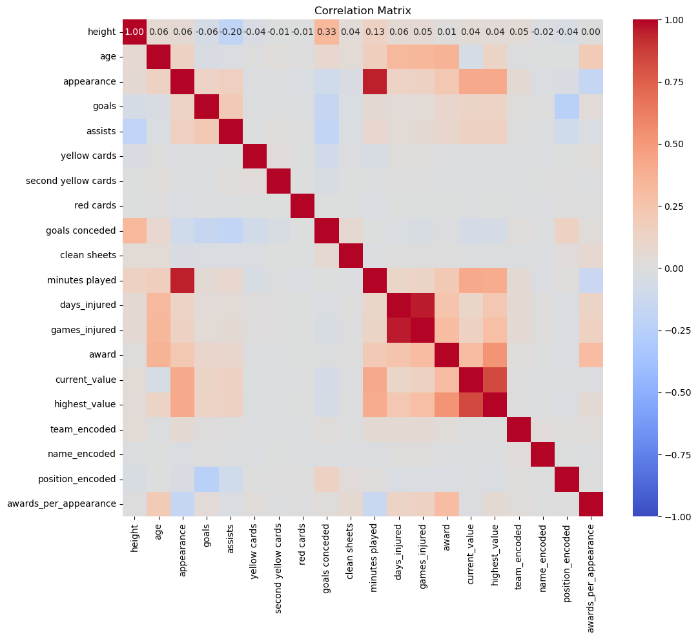

# Mini-Project-ML

This repository contains a machine learning project focused on predicting the current value of soccer players based on various performance metrics.

## Table of Contents

- [Project Overview](#project-overview)
- [Dataset](#dataset)
- [Preprocessing](#preprocessing)
- [Feature Engineering](#feature-engineering)
- [Modeling](#modeling)
- [Evaluation](#evaluation)
- [Installation](#installation)
- [Usage](#usage)
- [Results](#results)
- [Contributing](#contributing)
- [License](#license)

## Project Overview

The goal of this project is to develop a machine learning model that can predict the current market value of soccer players based on their performance metrics. This involves data cleaning, feature engineering, model training, hyperparameter tuning, and evaluation.

## Dataset

The dataset used in this project includes various performance metrics for soccer players such as goals, assists, minutes played, and more. The target variable is the current value of the players.

## Preprocessing

The preprocessing steps include:
- Handling missing values.
- Encoding categorical variables using `LabelEncoder`.
- Scaling numerical features using `StandardScaler`.
- Removing outliers based on the Interquartile Range (IQR) method.

## Feature Engineering

Additional features were created to enhance the model:
- `awards_per_appearance`: Calculated as the ratio of awards won to appearances made by the player.

Selecting features based on a Correlation Matrix:

Based on the correlation analysis, we can select the top features for model training:

- highest_value
- minutes played
- appearance
- award
- assists
- games_injured
- goals
- days_injured

## Modeling

The following machine learning models were used:
- Gradient Boosting Regressor
- XGBoost Regressor

Hyperparameter tuning was performed using Grid Search with Cross-Validation to find the best model parameters.

## Evaluation

The models were evaluated based on the following metrics:
- Mean Absolute Error (MAE)
- Mean Squared Error (MSE)
- R-squared (R²)

Cross-validation was also used to ensure the robustness and consistency of the model performance.
